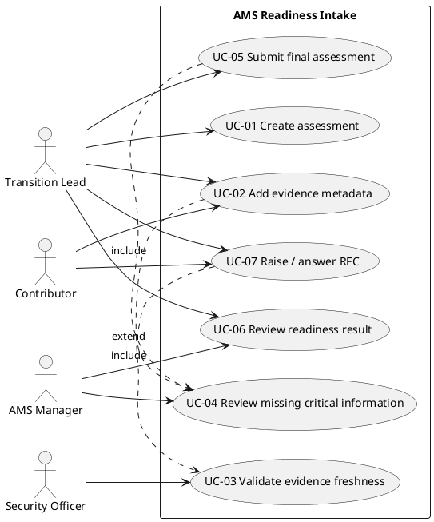

# Use Cases

This deliverable models the main interactions between the actors and the **AMS Transition Intake
& Readiness Assessment** module. It contains a use case diagram (3+ actors, 6 use cases, system
boundary and two `include` relationships) and two detailed use cases linked to the requirements
in `docs/02_objectives_csfs_requirements.md`.

## Actors

| Actor | Description |
|---|---|
| Transition Lead (TL) | Leads the transition; creates and submits the final assessment. |
| Contributor (C) | Fills in and edits draft answers and evidence. |
| Security Officer (SO) | Owns access/traceability rules; reviews evidence governance. |
| AMS Manager (AM) | Consumes the readiness result to prioritize the first 90 days. |

## Use Case Diagram (PlantUML)



### Textual diagram (fallback)

```
System boundary: AMS Readiness Intake
  UC-01 Create assessment .............. Transition Lead
  UC-02 Add evidence metadata .......... Contributor, Transition Lead
        └─ include → UC-03 Validate evidence freshness
  UC-03 Validate evidence freshness .... Security Officer
  UC-04 Review missing critical info ... AMS Manager
  UC-05 Submit final assessment ........ Transition Lead
        └─ include → UC-04 Review missing critical information
  UC-06 Review readiness result ........ AMS Manager, Transition Lead
  UC-07 Raise / answer RFC ............. Transition Lead (raises), Contributor (answers)
        └─ extend → UC-04 (an RFC may extend the review of missing critical information)
```

### Use case ↔ requirement overview

| Use case | Related requirements |
|---|---|
| UC-01 Create assessment | REQ-001 |
| UC-02 Add evidence metadata | REQ-002, REQ-010 (include UC-03) |
| UC-03 Validate evidence freshness | REQ-004 |
| UC-04 Review missing critical information | REQ-003 |
| UC-05 Submit final assessment | REQ-005, REQ-008 (include UC-04); baseline REQ-004 |
| UC-06 Review readiness result | REQ-006, REQ-007 |
| UC-07 Raise / answer RFC *(CR-01)* | REQ-011, REQ-012, REQ-008 |

---

## UC-05 — Submit final assessment  *(detailed)*

- Use Case ID: UC-05
- Title: Submit final assessment
- Primary actor: Transition Lead
- Goal: Submit a complete and valid readiness assessment so it is recorded as `submitted`.
- Preconditions: An assessment exists in status `draft`; the user is authenticated with a role.
- Trigger: The Transition Lead requests submission of the draft assessment.
- Related requirements: REQ-005, REQ-008, REQ-003, REQ-004 (baseline), REQ-010, REQ-006.

### Main flow
1. The Transition Lead requests submission of a draft assessment.
2. The system verifies the user's role is **Transition Lead** (REQ-008).
3. The system checks that no mandatory readiness area lacks complete evidence (include **UC-04**, REQ-003).
4. The system checks that no critical evidence is stale, i.e. older than 90 days (REQ-004, baseline blocks).
5. The system checks that every evidence item has `source`, `owner` and `freshness_date` (REQ-010).
6. The system sets the assessment status to `submitted` and shows the readiness result and score (REQ-006).

### Alternative flows
- AF-1 (missing critical information): at step 3, if a mandatory area lacks evidence, the system blocks submission, lists the missing critical information, and the assessment stays `draft`.

### Exceptions
- EX-1 (unauthorized role): at step 2, if the role is not Transition Lead, the submission is **denied**, recorded, and the assessment stays `draft` (REQ-008).
- EX-2 (stale critical evidence): at step 4, if critical evidence is stale, the submission is **blocked** and the stale items are listed (baseline REQ-004).

### Postconditions
- Success: the assessment is `submitted` and the readiness result is available.
- Failure: the assessment remains `draft`; the blocking reason (unauthorized / missing / stale) is shown.

---

## UC-02 — Add evidence metadata  *(detailed)*

- Use Case ID: UC-02
- Title: Add evidence metadata
- Primary actor: Contributor (also available to Transition Lead)
- Goal: Record an evidence item with valid metadata, with its freshness evaluated.
- Preconditions: An assessment exists in status `draft`; the user may edit drafts.
- Trigger: The user adds an evidence item to a draft assessment.
- Related requirements: REQ-002, REQ-010, REQ-009; include UC-03 (REQ-004).

### Main flow
1. The user opens the evidence form on a draft assessment.
2. The user enters `source`, `owner`, `freshness_date`, and optionally `category` and `criticality`.
3. The system validates that the three mandatory fields are present (REQ-002, REQ-010).
4. The system evaluates freshness — if `freshness_date` is older than 90 days, the item is marked `stale` (include **UC-03**, REQ-004).
5. The system persists the evidence item and shows it in the list with its freshness status.

### Alternative flows
- AF-1 (optional fields empty): at step 2, if `category`/`criticality` are empty, the item is still accepted (they are optional).

### Exceptions
- EX-1 (missing mandatory field): at step 3, if `source`, `owner` or `freshness_date` is missing, the item is **rejected** with an inline validation message (REQ-009, REQ-010).

### Postconditions
- Success: the evidence item is saved and its freshness status is computed.
- Failure: nothing is saved; a validation message explains what is missing.

---

## UC-07 — Raise / answer RFC  *(detailed — added by CR-01)*

- Use Case ID: UC-07
- Title: Raise / answer RFC (Request for Comment)
- Primary actor: Transition Lead (raises); Contributor (answers)
- Goal: Capture missing transition knowledge through a structured RFC that can feed future AMS documentation/FAQ.
- Preconditions: An assessment/intake exists; the user is authenticated with a role.
- Trigger: The Transition Lead needs further information about an intake and raises an RFC.
- Related requirements: REQ-011, REQ-012, REQ-008 (role), REQ-003 (missing info).

### Main flow
1. The Transition Lead selects an intake/assessment and chooses to raise an RFC.
2. The system verifies the user's role is **Transition Lead** (REQ-008).
3. The Transition Lead enters a title and the request/content; optionally references a missing-critical-information item (REQ-003).
4. The system persists the RFC with status `open` (REQ-011).
5. A Contributor adds a response to the open RFC; the response can be marked as reusable knowledge (REQ-012).
6. The Transition Lead reviews the responses and moves the RFC to status `answered`.

### Alternative flows
- AF-1 (knowledge promotion): at step 5, a response marked as reusable knowledge is flagged for promotion to transition documentation / future FAQ.

### Exceptions
- EX-1 (unauthorized raise): at step 2, if the role is not Transition Lead, the RFC is **not created** and the attempt is denied (REQ-008).

### Postconditions
- Success: an RFC exists (`open` → `answered`) with at least one response; reusable knowledge is captured.
- Failure: no RFC is created; the reason (unauthorized) is shown.
