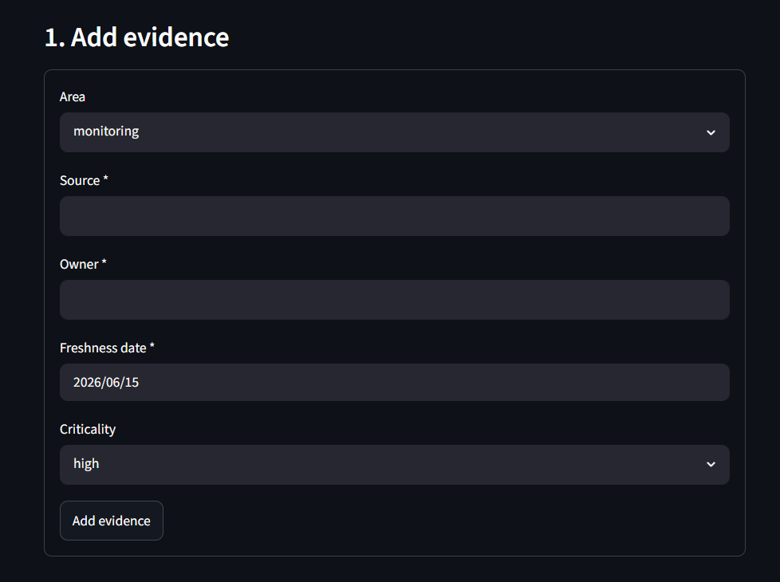
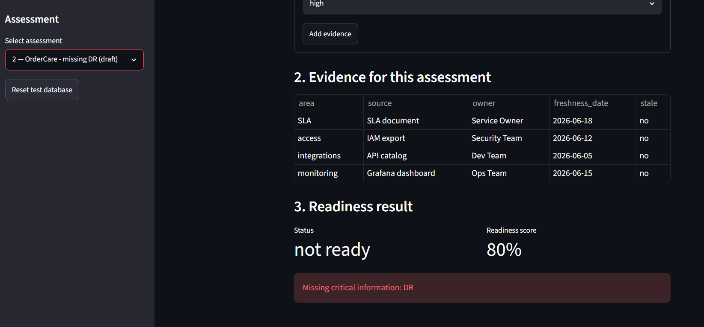
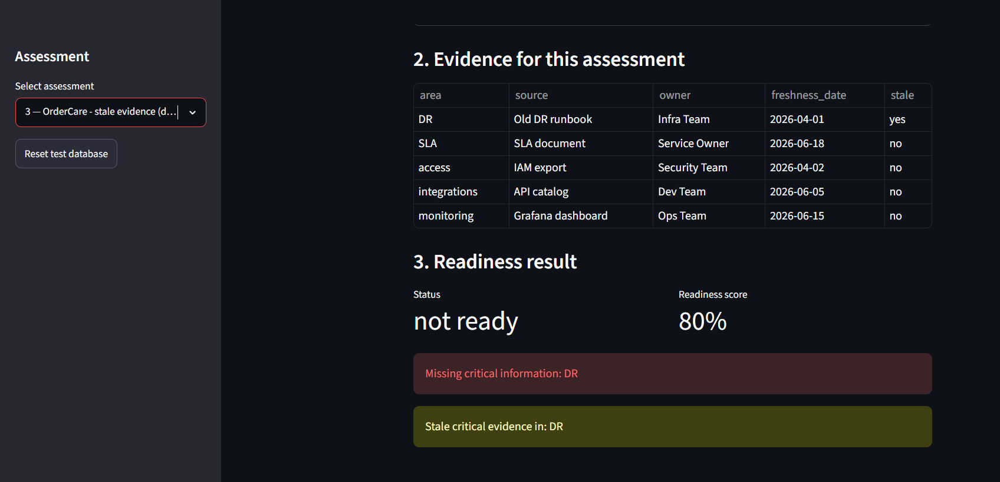

# App Evidence — screenshots and notes

Evidence that the AMS Readiness Intake app runs and enforces its business rules.

## How this was produced
- Command: `python app/main.py` (dependency-free CLI flow over the seeded SQLite database).
- The Streamlit UI (`streamlit run app/app.py`) uses the same `readiness_rules` logic.

## CLI run output (evidence of behaviour)
```
AMS Readiness Intake — reference date 2026-07-01

Assessment 1 — OrderCare - complete
  status: ready  score: 100%

Assessment 2 — OrderCare - missing DR
  status: not ready  score: 80%
  missing: DR

Assessment 3 — OrderCare - stale evidence
  status: not ready  score: 80%
  missing: DR
  stale: DR

Submission attempts on assessment 1 (complete):
  Contributor (bob): allowed=False reasons=['unauthorized: only a Transition Lead can submit']
  Transition Lead (alice): allowed=True reasons=[]

RFC (CR-01):
  Contributor raising RFC -> denied: Only a Transition Lead can raise an RFC
  Transition Lead raised RFC id=2
```

## What this demonstrates (mapped to requirements)
- Assessment 2 shows **missing critical information** (DR) — REQ-003.
- Assessment 3 shows **stale critical evidence** (DR at 91 days) while access at exactly 90 days is
  still counted — the **boundary** rule — REQ-004.
- Submission is **role-controlled**: Contributor denied, Transition Lead allowed — REQ-005 / REQ-008.
- RFC creation is **role-controlled** — REQ-011 / REQ-008 (CR-01).

## Streamlit UI screenshots (to add)
> Miguel: run `streamlit run app/app.py`, then capture and drop the images here.
1. `evidence/ui_add_evidence.png` — the evidence form with the three mandatory fields.
2. `evidence/ui_missing_info.png` — assessment "missing DR" showing missing critical information.
3. `evidence/ui_stale.png` — assessment "stale evidence" showing the stale flag and readiness score.
```



```
